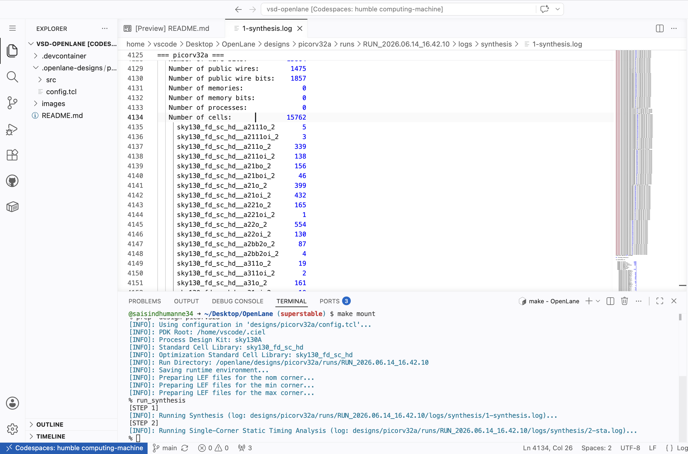

# SoC Design of PicoRV32 RISC-V Micro-Processor

This repository documents my journey through the VSD SoC Design and Planning 
Workshop — implementing a complete Physical Design flow for the PicoRV32 
RISC-V processor using open-source tools.

**Workshop:** VSD SoC Design and Planning  
**Tools:** OpenLANE | Magic | OpenSTA | NGSpice | Sky130 PDK  
**Design:** PicoRV32 RISC-V Core  

---

## Day 1 — Getting Started with Open-Source Chip Design

### The Chip vs The Package

Most people point to the black component on a circuit board and call it 
a chip — but that's actually the **package**. The real silicon die sits 
hidden inside, protected by this casing. It connects to the outside world 
through **wire bonds** — microscopic wires that link the die's contact 
pads to the package pins.

### What's Inside a Chip

Zooming into the silicon die, three regions define its structure:

- **Core** — where all the logic gates, flip flops and digital circuits live
- **Pads** — the boundary ring through which signals enter and exit the chip
- **Die** — the complete silicon piece that gets cut from the wafer

A few terms worth knowing:
- **Foundry** — the factory that physically manufactures the chip (eg. TSMC, SkyWater)
- **Foundry IPs** — blocks like PLLs and SRAMs that only the foundry knows how to build properly
- **Macros** — pre-designed digital blocks that get dropped into the layout

### How Software Becomes Silicon

When you write code in C and run it on a chip, it travels through 
multiple layers before it becomes electrical signals:
C Program

↓ Compiler

RISC-V Assembly

↓ Assembler

Binary (0s and 1s)

↓ RTL Implementation

Hardware Logic

↓ Physical Design Flow

Silicon Chip
The OS, compiler and assembler together form the bridge between 
human-written code and the actual hardware that executes it.

### The Open-Source ASIC Design Stack

Three ingredients are needed to design a chip:

| Ingredient | What it is | Where to get it |
|---|---|---|
| RTL Design | Hardware description of the chip | opencores.org, librecores.org |
| EDA Tools | Software to implement the design | OpenLANE, Magic, OpenSTA |
| PDK Data | Foundry rules and cell libraries | Sky130 PDK by Google + SkyWater |

Before 2020, PDKs were only available under NDAs — meaning chip design 
was locked behind closed doors. In **June 2020**, Google and SkyWater 
changed everything by releasing **Sky130** as the world's first open-source 
PDK. This made real chip design accessible to students and researchers 
for the first time.

### OpenLANE — The Full Flow in One Tool

| Stage | Tool | What Happens |
|---|---|---|
| Synthesis | Yosys + ABC | RTL code is converted into logic gates using standard cell library |
| Floorplanning | OpenROAD | Chip size is defined, blocks are positioned, power grid is created |
| Placement | OpenROAD | Standard cells are placed into rows inside the chip area |
| Clock Tree Synthesis | TritonCTS | Clock signal is distributed to all flip flops with minimum skew |
| Routing | FastRoute + TritonRoute | Metal wires connect all placed cells following PDK design rules |
| Parasitic Extraction | OpenRCX | Wire resistance and capacitance are extracted for accurate timing |
| Layout Export | Magic + KLayout | Final layout is exported as GDSII file for fabrication |
| Timing Sign-off | OpenSTA | Setup and hold timing is verified across all paths |
| Physical Verification | Magic + Netgen | DRC and LVS checks confirm layout is manufacture-ready |

## Lab 1 — OpenLANE Interactive Flow and Synthesis of picorv32a

### Running the Flow

OpenLANE is launched in interactive mode and the picorv32a design 
is prepared and synthesized step by step. The screenshot below shows 
all the commands run in sequence — mounting OpenLANE, launching 
interactive flow, preparing the design and running synthesis.

```bash
cd ~/Desktop/OpenLane
make mount
./flow.tcl -interactive
package require openlane 1.0.2
prep -design picorv32a
run_synthesis
```


### Synthesis Report — Cell Count

After synthesis we open the report to check the total number 
of cells in the design — **15762 cells** in total.



### Synthesis Report — Flip Flop Count

From the same report we identify the DFF count — **1613 flip flops** 
used in the design.


### Flop Ratio Calculation
Flop Ratio = 1613 / 15762 = 10.23%

10% of the total cells are flip flops — healthy for a 
processor design like PicoRV32.
