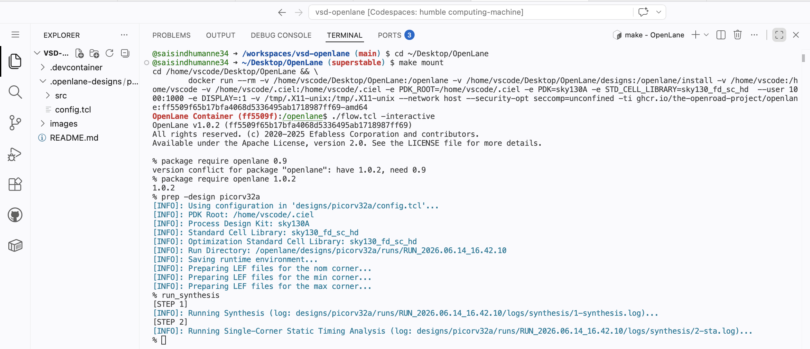
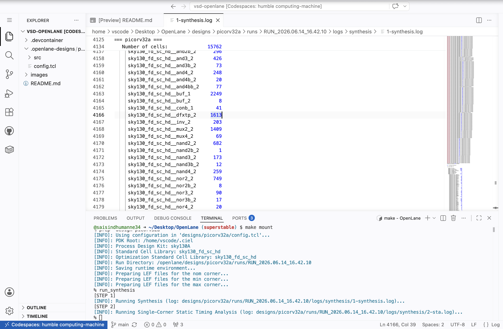
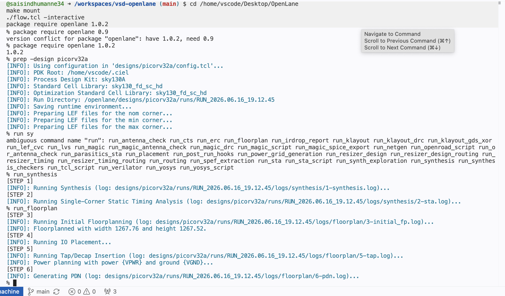
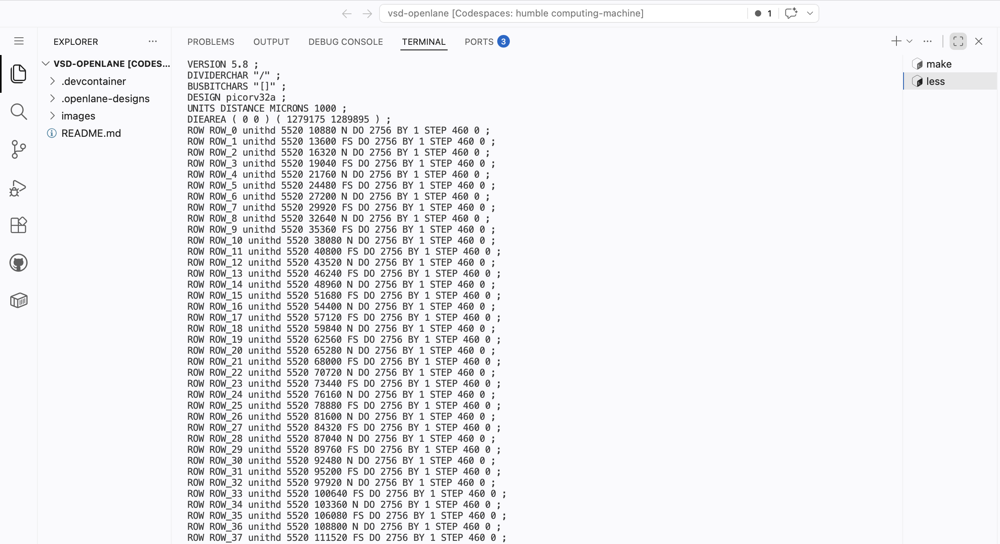
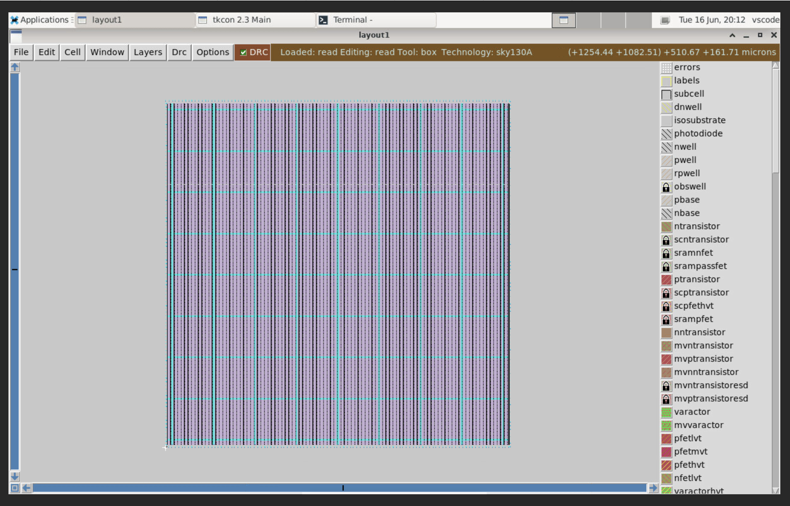
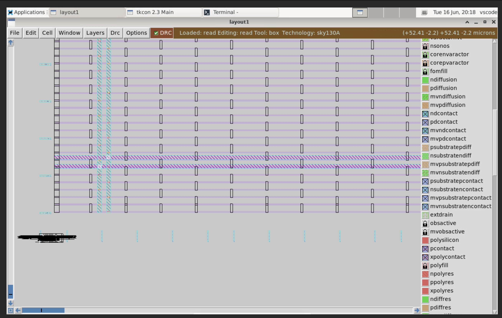
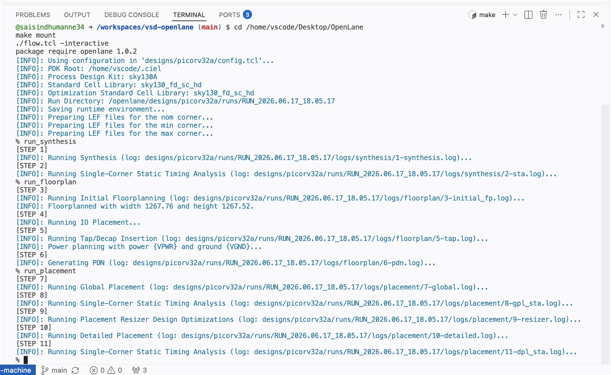
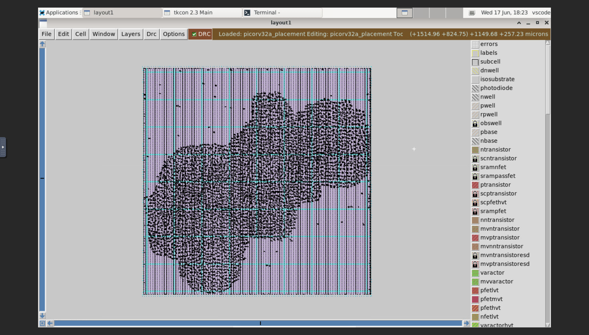
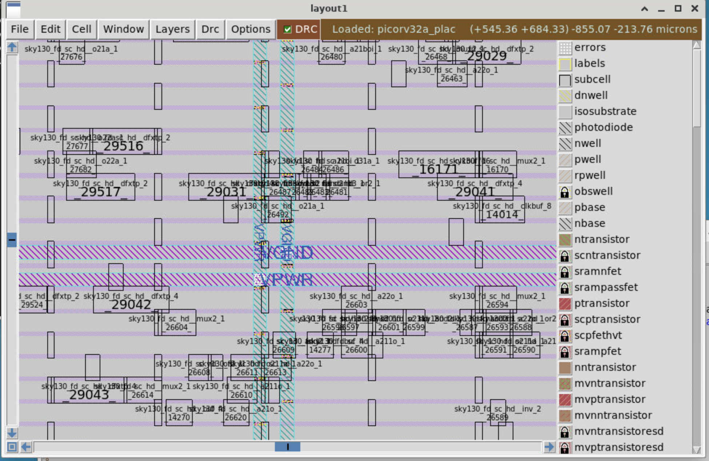

# SoC Design of PicoRV32 RISC-V Micro-Processor

This repository documents my journey through the VSD SoC Design and Planning 
Workshop — implementing a complete Physical Design flow for the PicoRV32 
RISC-V processor using open-source tools.

**Workshop:** VSD SoC Design and Planning  
**Tools:** OpenLANE | Magic | OpenSTA | NGSpice | Sky130 PDK  
**Design:** PicoRV32 RISC-V Core  

---

## Day 1 — Getting Started with Open-Source Chip Design

### The Chip vs The Package

Most people point to the black component on a circuit board and call it 
a chip — but that's actually the **package**. The real silicon die sits 
hidden inside, protected by this casing. It connects to the outside world 
through **wire bonds** — microscopic wires that link the die's contact 
pads to the package pins.

### What's Inside a Chip

Zooming into the silicon die, three regions define its structure:

- **Core** — where all the logic gates, flip flops and digital circuits live
- **Pads** — the boundary ring through which signals enter and exit the chip
- **Die** — the complete silicon piece that gets cut from the wafer

A few terms worth knowing:
- **Foundry** — the factory that physically manufactures the chip (eg. TSMC, SkyWater)
- **Foundry IPs** — blocks like PLLs and SRAMs that only the foundry knows how to build properly
- **Macros** — pre-designed digital blocks that get dropped into the layout

### How Software Becomes Silicon

When you write code in C and run it on a chip, it travels through 
multiple layers before it becomes electrical signals:
C Program

↓ Compiler

RISC-V Assembly

↓ Assembler

Binary (0s and 1s)

↓ RTL Implementation

Hardware Logic

↓ Physical Design Flow

Silicon Chip
The OS, compiler and assembler together form the bridge between 
human-written code and the actual hardware that executes it.

### The Open-Source ASIC Design Stack

Three ingredients are needed to design a chip:

| Ingredient | What it is | Where to get it |
|---|---|---|
| RTL Design | Hardware description of the chip | opencores.org, librecores.org |
| EDA Tools | Software to implement the design | OpenLANE, Magic, OpenSTA |
| PDK Data | Foundry rules and cell libraries | Sky130 PDK by Google + SkyWater |

Before 2020, PDKs were only available under NDAs — meaning chip design 
was locked behind closed doors. In **June 2020**, Google and SkyWater 
changed everything by releasing **Sky130** as the world's first open-source 
PDK. This made real chip design accessible to students and researchers 
for the first time.

### OpenLANE — The Full Flow in One Tool

| Stage | Tool | What Happens |
|---|---|---|
| Synthesis | Yosys + ABC | RTL code is converted into logic gates using standard cell library |
| Floorplanning | OpenROAD | Chip size is defined, blocks are positioned, power grid is created |
| Placement | OpenROAD | Standard cells are placed into rows inside the chip area |
| Clock Tree Synthesis | TritonCTS | Clock signal is distributed to all flip flops with minimum skew |
| Routing | FastRoute + TritonRoute | Metal wires connect all placed cells following PDK design rules |
| Parasitic Extraction | OpenRCX | Wire resistance and capacitance are extracted for accurate timing |
| Layout Export | Magic + KLayout | Final layout is exported as GDSII file for fabrication |
| Timing Sign-off | OpenSTA | Setup and hold timing is verified across all paths |
| Physical Verification | Magic + Netgen | DRC and LVS checks confirm layout is manufacture-ready |

## Lab 1 — OpenLANE Interactive Flow and Synthesis of picorv32a

### Running the Flow

OpenLANE is launched in interactive mode and the picorv32a design 
is prepared and synthesized step by step. The screenshot below shows 
all the commands run in sequence — mounting OpenLANE, launching 
interactive flow, preparing the design and running synthesis.

```bash
cd ~/Desktop/OpenLane
make mount
./flow.tcl -interactive
package require openlane 1.0.2
prep -design picorv32a
run_synthesis
```



### Synthesis Report — Cell Count

After synthesis we open the report to check the total number 
of cells in the design — **15762 cells** in total.


### Synthesis Report — Flip Flop Count

From the same report we identify the DFF count — **1613 flip flops** 
used in the design.



### Flop Ratio Calculation
Flop Ratio = 1613 / 15762 = 10.23%

10% of the total cells are flip flops — healthy for a 
processor design like PicoRV32.

# Day 2 — Good FloorPlan vs Bad FloorPlan and Introduction to Library Cells

---

## 1. Chip Floorplanning

Floorplanning is the first step after synthesis. It decides the size and shape of the chip, where IO pins go, and where big blocks (like memories) are placed.

Two key parameters:
- **Utilisation Factor** = Area used by cells / Total core area. Typical value: 0.5–0.6 (leave room for routing and buffers)
- **Aspect Ratio** = Height / Width. A value of 1 means a square chip.

---

## 2. Pre-Placed Cells and Decoupling Capacitors

**Pre-placed cells** are large blocks (memories, PLLs, IPs) that are placed manually before the tool runs. The tool won't move them.

**Decoupling capacitors (DECAPs)** are placed around these blocks. When many gates switch at once, they need a lot of current instantly. DECAPs act like local batteries — they supply that current and prevent the voltage from dropping, which could cause logic errors.

---

## 3. Power Planning

Power is delivered using a **power mesh** — a grid of VDD and VSS wires on upper metal layers covering the whole chip. This ensures every cell gets power from nearby, reducing **IR drop** (voltage loss due to wire resistance) and **electromigration** (wire damage from high current).

---

## 4. Pin Placement and Cell Blockage

IO pins are placed along the chip edges. Pins are placed close to the logic they connect to, so wires stay short.

The area between the core and the die edge is blocked — called a **logical cell blockage** — so the placer doesn't put standard cells there. That space is reserved for IO buffers and ESD cells.

---

## 5. Library Binding and Placement

Each gate in the netlist is mapped to a real physical cell from the library. The library has cells of different sizes and speeds for the same logic function.

- **Initial placement** puts cells inside the core, trying to keep connected cells close together.
- **Placement optimisation** checks wire lengths. If a wire is too long and signal quality drops, **buffers (repeaters)** are inserted to fix it.

---

## 6. Cell Design Flow

Every standard cell is created through this flow:

**Inputs** → PDK (DRC/LVS rules, SPICE models, design rules)

**Design Steps:**
- **Circuit design** — size the transistors to meet speed and drive strength targets
- **Layout design** — draw the physical layout using Euler's path + stick diagram to minimise diffusion breaks
- **Characterisation** — simulate the cell to extract timing, power, and noise data

**Outputs** → CDL netlist, GDSII, LEF, extracted SPICE (.cir), timing/power/noise `.lib` files

Cells come in different flavours: different functions (AND, OR, buffer, DFF...) and different threshold voltages (hvt, svt, lvt) to trade off speed vs power.

---

## 7. Characterization Flow

The **GUNA** tool takes 8 inputs and generates the `.lib` models used in STA:

1. NMOS and PMOS SPICE models
2. Extracted cell subcircuit (`.sub` file)
3. Testbench — two cascaded inverters with a 10f load cap
4. Cell subcircuit (PMOS: W=0.9u/L=0.18u, NMOS: W=0.36u/L=0.18u)
5. Power supply (VDD = 1.8V)
6. Input pulse stimulus
7. Output load capacitance
8. Transient simulation command (`.tran 10e-12 4e-09`)

GUNA outputs four model types: **Timing**, **Noise**, **Power**, and **Function** — all stored as `.lib` files used by STA and PD tools.

---

## 8. Timing Characterization

Timing is measured using 8 voltage threshold variables defined in the `.lib` file:

- `slew_low_rise_thr`, `slew_high_rise_thr` — low and high thresholds for rise slew
- `slew_low_fall_thr`, `slew_high_fall_thr` — low and high thresholds for fall slew
- `in_rise_thr`, `in_fall_thr` — input thresholds for delay measurement
- `out_rise_thr`, `out_fall_thr` — output thresholds for delay measurement

The actual threshold values depend on the PDK and the cell being characterised.

**Propagation delay** = `time(out_*_thr) − time(in_*_thr)`
- A well-chosen threshold gives a small positive delay
- A bad threshold choice or too large an output load can give a negative delay — this is incorrect and must be avoided

**Transition time (slew):**
- Rise slew = `time(slew_high_rise_thr) − time(slew_low_rise_thr)`
- Fall slew = `time(slew_high_fall_thr) − time(slew_low_fall_thr)`

---

## 9. Lab — Floorplan

### Running Floorplan

```bash
run_floorplan
cd results/floorplan/
less picorv32a.def
```

### Floorplan DEF File

The output DEF file is at:
```
runs/RUN_2026.06.17_18.05.17/results/floorplan/picorv32a.def
```




picorv32a floorplan DEF file — DIEAREA and standard cell ROW definitions


### Floorplan in Magic

```bash
magic -T /home/vscode/.ciel/ciel/sky130/versions/0fe599b2afb6708d281543108caf8310912f54af/sky130A/libs.tech/magic/sky130A.tech \
  lef read ../../tmp/merged.nom.lef \
  def read picorv32a.def &
```


picorv32a floorplan in Magic — purple/pink = pwell, cyan lines = standard cell rows, IO pins on all 4 edges




---

## 10. Lab — Placement

### Running Placement

```bash
run_placement
```


Terminal showing all placement steps completing successfully for picorv32a

### Placement in Magic

```bash

cd /home/vscode/Desktop/OpenLane/designs/picorv32a/runs/RUN_2026.06.17_18.05.17/results/placement/
magic -T /home/vscode/.ciel/ciel/sky130/versions/0fe599b2afb6708d281543108caf8310912f54af/sky130A/libs.tech/magic/sky130A.tech \
  lef read ../../tmp/merged.nom.lef \
  def read picorv32a.def &
```

**Global placement view** — all standard cells are placed inside the core. The dense dark regions are clusters of logic cells.



*picorv32a after global placement — standard cells distributed across the core*

**Zoomed-in view** — individual `sky130_fd_sc_hd_*` standard cells are visible. The horizontal striped bands are the **VPWR** and **VGND** power rails running across each cell row.




